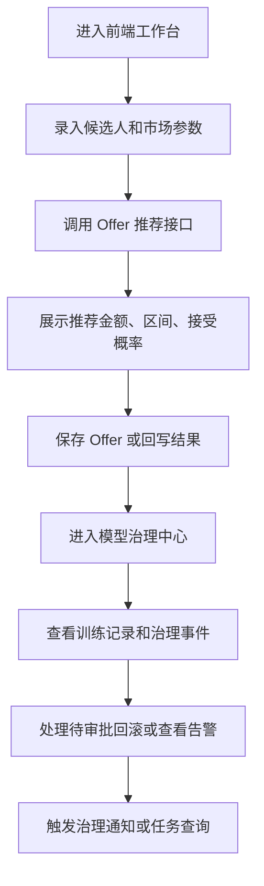

## 1. 产品概述
AI Offer 智能薪酬决策系统当前已具备完整后端 API、训练治理与审批链路，前端 MVP 需要把这些能力转化为可操作、可解释、可审计的桌面端工作台。
- 目标用户为 HRBP、招聘经理、薪酬分析师、模型治理/风控审批人员。
- 目标价值是让用户在一个统一界面内完成候选人录入、Offer 推荐、风险解释、治理审批与模型状态查看，降低跨系统切换成本。

## 2. 核心功能

### 2.1 用户角色
| 角色 | 进入方式 | 核心权限 |
|------|----------|----------|
| HR 操作员 | 内网工作台登录态预留 | 创建候选人、查看市场薪资、生成 Offer、更新结果 |
| 招聘经理 | 内网工作台登录态预留 | 查看推荐结果、风险与公平性解释 |
| 薪酬分析师 | 内网工作台登录态预留 | 查看市场分位、策略配置、历史 Offer 表现 |
| 治理审批人 | 内网工作台登录态预留 | 审批高风险回滚、查看告警、执行治理通知 |

### 2.2 功能模块
1. **Offer 工作台**：候选人信息输入、市场数据参考、推荐 Offer 结果、风险与公平性摘要。
2. **候选人与 Offer 管理**：候选人创建、Offer 列表查询、Offer 结果回写、历史详情查看。
3. **模型治理中心**：模型版本、训练记录、治理事件、待审批回滚、治理告警、通知投递预览。
4. **系统状态与任务面板**：任务调度、训练任务、治理扫描任务、通知任务状态查看。

### 2.3 页面详情
| 页面名称 | 模块名称 | 功能说明 |
|---------|---------|---------|
| Offer 工作台 | 候选人表单 | 输入当前薪资、经验、级别、面试分、是否有其他 Offer 等参数 |
| Offer 工作台 | 市场基准卡片 | 展示 P25/P50/P75、城市、岗位、更新时间 |
| Offer 工作台 | 推荐结果面板 | 展示推荐 Offer、建议区间、接受概率、竞争力评分 |
| Offer 工作台 | 风险与公平性面板 | 展示预算风险、薪资倒挂、内部公平摘要与原因列表 |
| 候选人与 Offer 管理 | 候选人创建抽屉 | 调用候选人创建接口生成基础档案 |
| 候选人与 Offer 管理 | Offer 列表 | 按候选人、风险等级、策略过滤历史 Offer |
| 候选人与 Offer 管理 | Offer 详情侧栏 | 查看推荐快照、风险理由、报告摘要、结果标签 |
| 候选人与 Offer 管理 | 结果回写表单 | 标记已接受/已拒绝、备注说明、决策时间 |
| 模型治理中心 | 活动模型卡片 | 展示当前活动模型版本、框架、关键指标 |
| 模型治理中心 | 训练记录表格 | 展示训练来源、激活模式、准确率、log loss、是否激活 |
| 模型治理中心 | 治理事件时间线 | 展示回滚、审批、过期、治理通知等事件上下文 |
| 模型治理中心 | 待审批操作台 | 审批或拒绝高风险回滚，录入 approvalTicket |
| 模型治理中心 | 告警中心 | 展示待审、即将过期、已过期等治理告警 |
| 模型治理中心 | 通知预览面板 | 预览 log/webhook-payload 投递内容并触发发送 |
| 系统状态与任务面板 | 计划任务列表 | 展示 market sync、governance expire、alert scan、notify 等定时任务 |
| 系统状态与任务面板 | 任务状态查询 | 输入 taskId 查看异步任务结果 |

## 3. 核心流程
用户先在 Offer 工作台录入候选人和市场背景信息，系统调用后端接口生成 Offer 推荐与解释结果；之后用户可将推荐结果保存、回写候选人最终接受情况，并在模型治理中心查看模型版本、训练记录和高风险审批事项；治理审批人可处理待审批回滚、查看告警，并根据告警触发通知任务。

## 4. 用户界面设计
### 4.1 设计风格
- 整体风格：桌面优先的企业决策驾驶舱，深色石墨底 + 冷白信息层 + 高饱和警示色点缀。
- 主色：石墨黑、雾白、蓝青色高亮；告警使用琥珀橙与洋红红。
- 按钮风格：圆角矩形，强调按钮使用发光描边与柔和阴影。
- 字体建议：标题使用具有报表感的衬线展示字体，正文使用高可读的人文无衬线字体。
- 布局风格：左侧导航 + 顶部上下文栏 + 多卡片驾驶舱式信息面板。
- 图标风格：线性图标搭配轻量状态圆点，避免拟物。

### 4.2 页面设计概览
| 页面名称 | 模块名称 | UI 元素 |
|---------|---------|---------|
| Offer 工作台 | 顶部概览带 | KPI 数字卡、当前活动模型、市场状态标签、渐变背景 |
| Offer 工作台 | 表单区 | 两列栅格、分组标题、输入提示、提交后结果动画切换 |
| Offer 工作台 | 推荐结果区 | 大号金额展示、概率环图、风险标签、解释列表 |
| 候选人与 Offer 管理 | 列表区 | 可筛选数据表格、状态标签、详情抽屉、空状态插画风格占位 |
| 模型治理中心 | 时间线与表格 | 左侧时间线、右侧告警/待审批卡片、数据表格固定头部 |
| 模型治理中心 | 通知预览区 | JSON 预览、文本预览、发送按钮、渠道切换标签 |
| 系统状态与任务面板 | 任务状态区 | 调度卡片、taskId 查询框、响应 JSON 结果面板 |

### 4.3 响应式
- 采用桌面优先设计，针对 1440px 宽度优化主视图。
- 1200px 以下收缩为双列或单列卡片布局。
- 768px 以下保留基础访问能力，但以信息浏览为主，复杂治理操作降级为分步展开。

