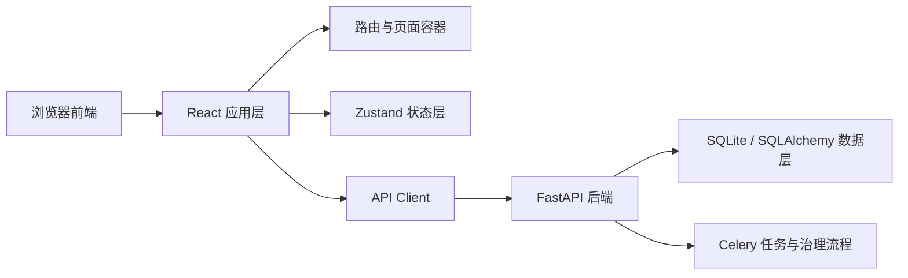
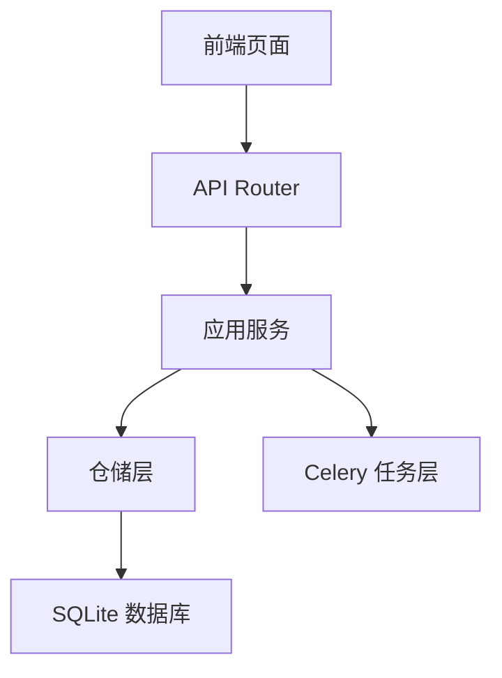
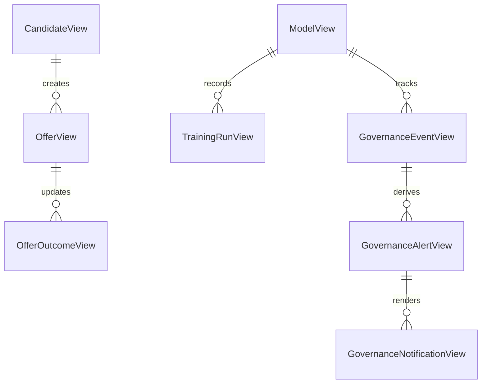

## 1. 架构设计


## 2. 技术描述
- 前端：React 18 + TypeScript + Vite
- 初始化方式：`vite-init` 的 `react-ts` 模板
- 路由：`react-router-dom`
- 样式：Tailwind CSS，结合局部 CSS 变量实现主题与仪表盘视觉
- 状态管理：Zustand
- 图标：`lucide-react`
- 图表：ECharts
- 表单与企业组件：Ant Design
- 数据请求：优先使用浏览器原生 `fetch`，按模块封装 API Client
- 测试：Vitest + React Testing Library

## 3. 路由定义
| 路由 | 用途 |
|------|------|
| / | 默认跳转到 Offer 工作台 |
| /workspace | Offer 工作台，负责候选人录入与推荐结果展示 |
| /offers | 候选人与 Offer 管理页 |
| /governance | 模型治理中心 |
| /tasks | 任务与调度面板 |

## 4. API 定义
### 4.1 核心 TypeScript 类型
```ts
export type OfferRecommendationRequest = {
  candidateId?: string
  strategyId?: string
  currentSalary: string
  yearsExperience: number
  level: string
  interviewScore: number
  hasOtherOffer: boolean
  positionId: string
  city: string
}

export type GovernanceAlert = {
  id: string
  eventId: string
  modelName: string
  alertType: string
  severity: string
  message: string
  operator: string
  expiresAt: string | null
}

export type GovernanceNotificationResponse = {
  channel: "log" | "webhook-payload"
  destination: string
  deliveryCount: number
  notifiedAlertIds: string[]
  deliveries: Array<{
    id: string
    alertId: string
    channel: string
    destination: string
    subject: string
    body: string
    payload: Record<string, unknown>
  }>
}
```

### 4.2 接口清单
| 接口 | 用途 |
|------|------|
| POST /api/v1/candidates | 创建候选人 |
| GET /api/v1/market-salary | 查询市场薪资 |
| POST /api/v1/offers/recommend-and-save | 生成并保存 Offer |
| GET /api/v1/offers | 查询 Offer 列表 |
| GET /api/v1/offers/{offer_id} | 查询 Offer 详情 |
| POST /api/v1/offers/{offer_id}/outcome | 回写 Offer 结果 |
| GET /api/v1/models/active | 查询活动模型 |
| GET /api/v1/models/training-runs | 查询训练记录 |
| GET /api/v1/models/governance-events | 查询治理事件 |
| GET /api/v1/models/governance-alerts | 查询治理告警 |
| POST /api/v1/models/governance-events/{event_id}/review | 审批高风险回滚 |
| POST /api/v1/models/governance-events/expire-pending | 手动过期待审事件 |
| POST /api/v1/models/governance-alerts/notify | 同步生成治理通知 |
| POST /api/v1/tasks/models/train | 触发训练任务 |
| POST /api/v1/tasks/models/governance-alert-scan | 触发告警扫描任务 |
| POST /api/v1/tasks/models/governance-alerts/notify | 触发治理通知任务 |
| GET /api/v1/tasks/schedules | 查询计划任务 |
| GET /api/v1/tasks/{task_id} | 查询任务状态 |

## 5. 服务端架构图


## 6. 数据模型
### 6.1 前端视图模型定义


### 6.2 前端状态划分
- `appShellStore`：主题、导航、当前页面上下文。
- `offerWorkspaceStore`：候选人表单、市场查询结果、推荐结果、提交状态。
- `offersStore`：Offer 列表、筛选器、详情抽屉状态。
- `governanceStore`：活动模型、训练记录、治理事件、告警、审批操作、通知预览。
- `tasksStore`：计划任务列表、任务状态查询结果。

## 7. 页面与组件拆分
- `src/pages/WorkspacePage.tsx`：Offer 工作台入口页面。
- `src/pages/OffersPage.tsx`：候选人与 Offer 管理页。
- `src/pages/GovernancePage.tsx`：治理中心页面。
- `src/pages/TasksPage.tsx`：任务与调度页。
- `src/components/layout/AppShell.tsx`：左导航与顶部栏。
- `src/components/workspace/RecommendationPanel.tsx`：推荐结果面板。
- `src/components/governance/GovernanceTimeline.tsx`：治理事件时间线。
- `src/components/governance/AlertNotificationPreview.tsx`：治理通知预览。

## 8. 实施约束
- 保持桌面优先，移动端仅做信息降级适配。
- 前端先对接已有 FastAPI，不新增 Node 后端。
- 默认以本地 `http://127.0.0.1:8000/api/v1` 为 API 根地址，并支持环境变量覆盖。
- 所有复杂页面拆分为小于 300 行的组件，公共逻辑放到 hooks 与 store。
- 开发完成后执行 `npm run check`、Vitest、浏览器端手工验证与截图确认。
